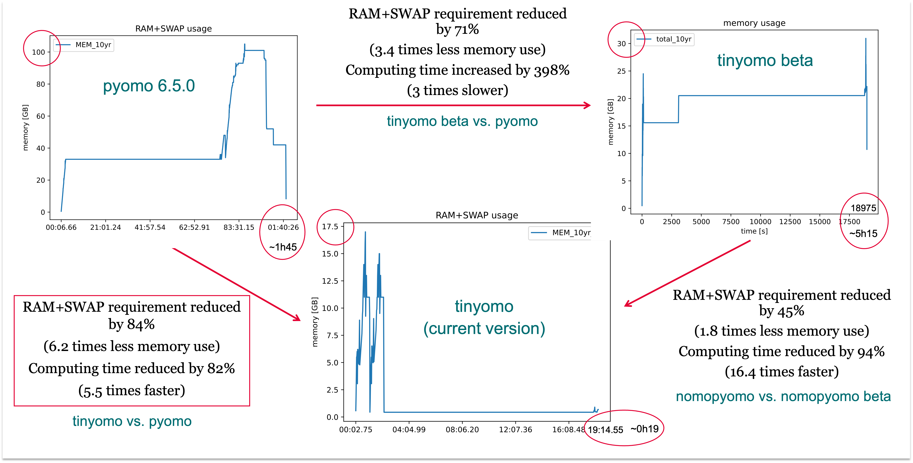

# tinyomo
Tinyomo stands for "tiny pyomo". It is a light weight [Pyomo](https://pyomo.readthedocs.io/en/stable/) alternative. It uses (much) less memory, but is also (much) less user-friendly!

# Background
We had problems with building relatively large LP problems on our hardware (a MacStudio with 64 GB RAM) using Pyomo. It took long and with bigger models even crashed the system.

That is why we built an alternative with two goals:
1. Use as little RAM as possible.
2. Do not increase model building time.

For our use case, memory usage and computing time are reduced each by over 80% compared to Pyomo.

# Basic idea
We first used a lot of Pandas dataframes to store the LP problem's elements, simply because dataframes are memory efficient[^1] and very practical to handle. However, doing millions of lookups on them is slow (as we should have known and profiling clearly showed). This was *tinyomo beta*.

[^1]: https://www.joeltok.com/posts/2021-06-memory-dataframes-vs-json-like/

Python dictionaries, on the other hand, are very fast to lookup because they are hash tables but they use up a lot more memory than dataframes for the same reason.[^2]
When we used dictionaries (actually dict of dicts) to store and lookup data in memory, it significantly improved speed but memory use was back to Pyomo levels. We had to aggressively further reduce the amount of data kept in memory to achieve the current tinyomo version. We did this by eliminating as much as redundant information in input parameter data, variables, and constraints as possible.

[^2]: https://stackoverflow.com/questions/513882/python-list-vs-dict-for-look-up-table

For example, the following table shows (in a simplified way) how model variables (i.e. columns of the LP problem matrix) are stored in memory in Pyomo vs. tinyomo.

Something similar (albeit more convoluted) happens for the model constraints (i.e. the equations of the model or lines of the LP problem matrix) which take up a huge amount of memory for large models in Pyomo.

In the end our own anecdotal benchmark on a real model built using ITOM (see Examples) confirmed that *tinyomo beta* was more memory efficient than Pyomo but way slower, while the current version is both much faster *and* memory efficient.

# Installation
The entire module is contained in one file: 'src/tinyomo.py'. Simply add this file to your project and use the tinyomo classes to define the sets, parameters, variables, constraints, and objective of your LP problem.

# Examples
The [ITOM framework](https://github.com/wupperinst/itom) (Industry Transformation Optimisation Model) was originally built with Pyomo and later duplicated with tinyomo.
It provides a good comparison point of the two syntaxes.
Actual LP problems built with ITOM modelling cost optimal future pathways for the petrochemical, steel, and cement sectors are available on [Zenodo](https://doi.org/10.5281/zenodo.15722549).

# Documentation
Documentation is coming up at [readthedocs](https://itom.readthedocs.io/en/latest/).

# Roadmap
Here are the main items on our wish-list:

* Properly package tinyomo so that it can easily be installed and updated with pip.

* Increase speed by parallelising as much of the LP problem construction as possible (with tinyomo and a 192 GB RAM MacStudio we can now build larger problems than ever but computing time has become the limiting factor).

* Make it easier (more user-friendly) to write equations for the constraints of the LP problem with tinyomo.

# Contributions
If you'd like to contribute, the [issues page](https://github.com/wupperinst/itom/issues) lists possible extensions and improvements.
If you wish to contribute your own, just create a fork and open a PR!

# License
[tinyomo](https://github.com/wupperinst/tinyomo) © 2025 by [Wuppertal Institute for climate, environment and energy](https://wupperinst.org/) is licensed under [GNU AGPL 3.0](https://www.gnu.org/licenses/agpl-3.0.html)